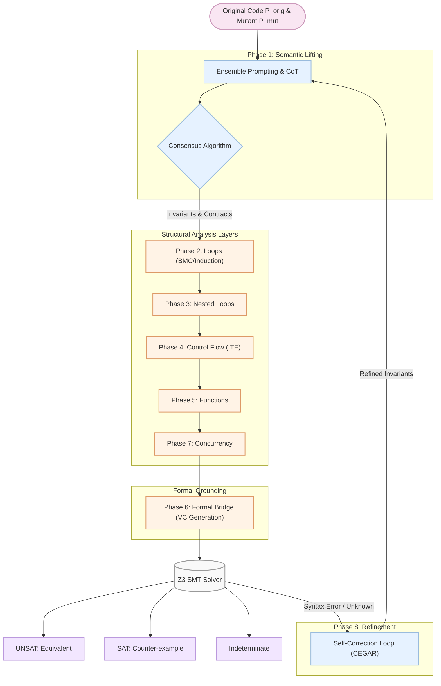

# Framework

## Introduction 
Dự án xử lý một số vấn đề liên quan đến **Equivalent Mutant Problem (EMP)** trong kiểm thử phần mềm đột biến (Mutation Testing). 
Hiện tại dự án vẫn đang được phát triển bởi nhóm nghiên cứu của chúng tôi, nhằm cung cấp một giải pháp hiệu quả cho bài toán kiểm tra tính tương đương của mã nguồn dựa trên suy luận tự động và mô hình ngôn ngữ lớn (LLMs).

## Architecture 

Dự án được thiết kế với một quy trình bao gồm nhiều giai đoạn (phases) kết hợp giữa phân tích ngữ nghĩa (Semantic Lifting), phân tích cấu trúc (Structural Analysis), và kiểm chứng hình thức (Formal Grounding) thông qua Z3 SMT Solver.



## Features 

Mã nguồn offline trong repository này triển khai một tập hợp con (subset) nhỏ, có thể kiểm thử được của toàn bộ framework:

1. **Structural analysis** cho các loops, branches, function calls, dynamic constructs, và bounded-concurrency flags.
2. **Offline semantic lifting** cho các ví dụ Python nhỏ, do đó repository có thể được kiểm thử mà không cần truy cập LLM được host trực tuyến.
3. **Formal bridge / VC execution** thông qua `z3-solver==4.12.2.0`.
4. **Conservative verdicts** khớp với paper: `Equivalent`, `Non-equivalent`, `Equivalent under Bound`, và `Indeterminate`.
5. **Phase 8 refinement prompts** cho các validation errors, kết quả UNKNOWN, và các candidate counterexamples.

*Lưu ý: Quá trình đánh giá full paper sử dụng một mutant-level manifest lớn hơn và front-end Java/Defects4J. Các cấu trúc không được hỗ trợ trong public prototype này sẽ trả về `Indeterminate` thay vì âm thầm được xấp xỉ là equivalent.*

## Installation 
```bash
pip install -r requirements.txt
```

## Usage 

```bash
python3 src/main.py --original benchmarks/sample_p.py --mutant benchmarks/sample_m.py
```

Expected result for the sample pair:

```text
VERDICT: Equivalent
Reason: UNSAT negated equivalence condition
```

## Tests 

Run all unit tests:

```bash
python3 -m unittest discover tests
```

Run smoke benchmarks:

```bash
python3 scripts/run_benchmarks.py
```
